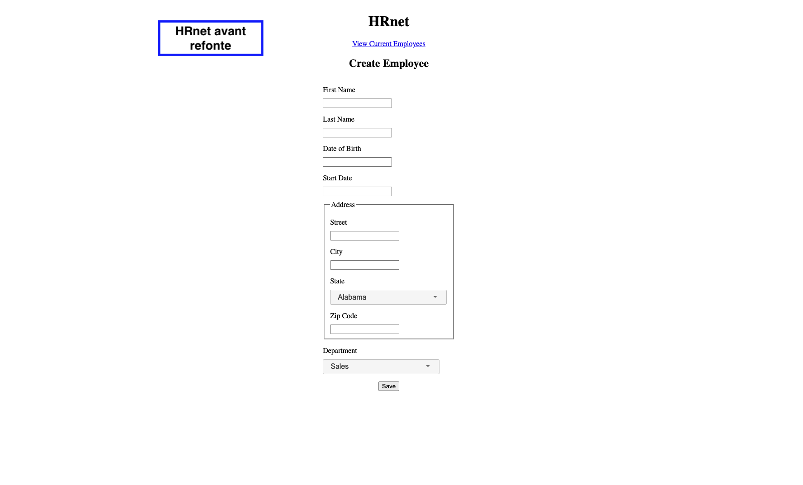
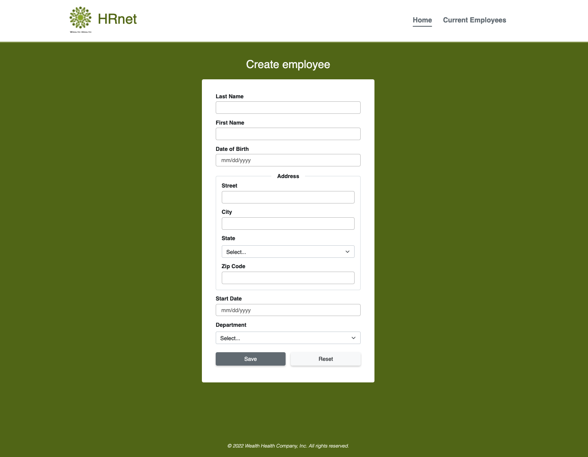

# HRnet, OpenClassrooms project #14

HR application allows to add new employee data and display current employees in a data table.

Convert a html/jquery HR app to a react app. These is the React version of the HRnet app.
The repository of the original project is [here](https://github.com/OpenClassrooms-Student-Center/P12_Front-end).

Convert 4 plugin jquery in React component and publish one of them as a npm package in npm site.
I chose to convert and publish the Select Menu. The repository of the component is [here](https://github.com/emilie-v11/P14_select-react-bootstrap), and the link to the package on the npm site here. [here](https://www.npmjs.com/package/select-react-bootstrap).

-   [See my Website](https://eager-wiles-f262a8.netlify.app/) 👋

**Old version of HRnet**

<kbd></kbd>

**New version of HRnet**

<kbd></kbd>

## Prerequisites

-   [npm](https://www.npmjs.com/) v7.24.0

-   [yarn](https://yarnpkg.com/) v1.22.11

## Dependencies

-   [React](https://reactjs.org/) v17.0.2

-   [Redux](https://redux.js.org/) v4.1.2

-   [react-redux](https://react-redux.js.org/) v7.2.6

-   [react-router-dom](https://reactrouter.com/web/guides/quick-start) v6.2.1

-   [redux-thunk](https://github.com/reduxjs/redux-thunk) v2.4.1

-   [redux-persist](https://yarnpkg.com/package/redux-persist) v6.0.0

-   [prop-types](https://yarnpkg.com/package/prop-types) v15.8.1

-   [bootstrap](https://yarnpkg.com/package/bootstrap) v5.1.3

-   [mui-datatables](https://yarnpkg.com/package/mui-datatables) v3.7.7

-   [react-datepicker](https://yarnpkg.com/package/react-datepicker) v4.6.0

-   [@material-ui/core](https://yarnpkg.com/package/@material-ui/core) v4.11.4

-   [@material-ui/icons](https://yarnpkg.com/package/@material-ui/icons) v4.11.2

-   [select-react-bootstrap](https://www.npmjs.com/package/select-react-bootstrap) v0.1.5

## Install this project on your local

-   Fork this repository

-   Clone to your local on a directory of your choice.

-   From the terminal, change directory to the cloned project directory.

-   Install with command `yarn install`

-   Run the project with command `yarn start`

This application will run on `http://localhost:3000`
